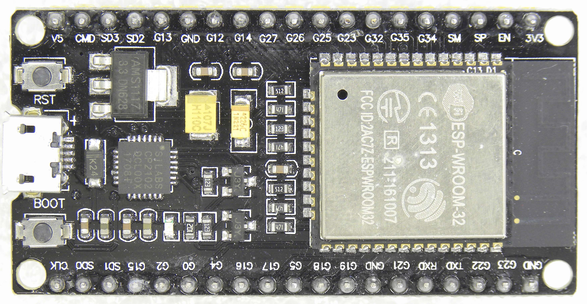
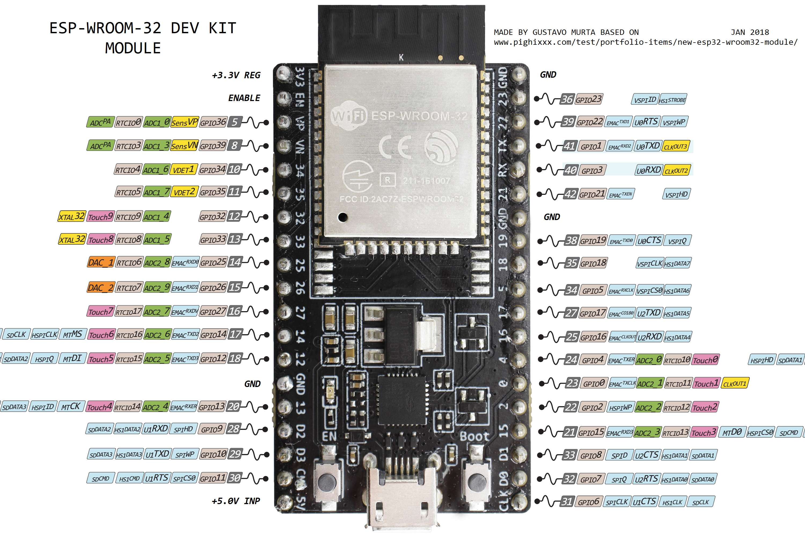

# ESP32-WROOM-32 - Descrição e Pinagem

Este documento contém informações sobre o módulo **ESP32-WROOM-32**, incluindo suas características, especificações e pinagem.

## 📷 Imagens da Placa  

### Vista do Módulo ESP32-WROOM-32  
  

### Pinagem do ESP32-WROOM-32  
  

---

## 📌 Descrição  

O **ESP32-WROOM-32** é um módulo Wi-Fi e Bluetooth baseado no microcontrolador **ESP32**, desenvolvido pela Espressif. Ele é amplamente utilizado em projetos de IoT, automação residencial, dispositivos vestíveis e sistemas embarcados.

### **Características Principais**
- **Wi-Fi 802.11 b/g/n** e **Bluetooth 4.2 (Classic e BLE)**.
- **Processador Dual-Core Xtensa LX6** com clock de até **240 MHz**.
- **Memória RAM de 520 KB** e suporte a **Flash de 4 MB ou mais**.
- **Baixo consumo de energia**, ideal para dispositivos móveis e aplicações IoT.
- **Suporte para múltiplos protocolos de comunicação**, incluindo UART, I2C, SPI, PWM, ADC e DAC.

---

## 📌 Pinagem do ESP32-WROOM-32  

O ESP32 possui diversos **GPIOs (General Purpose Input/Output)** que podem ser configurados para diferentes funções, como entradas, saídas digitais, ADC, DAC, I2C, SPI e PWM.

### **📍 Pinos superiores da placa**
| Pino  | Função |
|-------|--------|
| **V5**  | Alimentação 5V |
| **CMD, SD3, SD2** | Interface SPI/SD |
| **G13 a G14** | GPIOs gerais |
| **G27 a G34** | GPIOs, ADCs, I2C, PWM |
| **SM, SP** | SPI/UART |
| **EN** | Enable (ativação do ESP32) |
| **3V3** | Alimentação 3.3V |

### **📍 Pinos inferiores da placa**
| Pino  | Função |
|-------|--------|
| **GND** | Terra |
| **C0, C2** | GPIOs gerais |
| **G4, G5, G16** | GPIOs, PWM, ADC |
| **G17 a G19** | UART, SPI |
| **G21, G22** | I2C (SDA/SCL) |
| **RX0, TX0** | Comunicação serial (UART) |

---

## 📡 Interfaces Principais

- **ADC (Conversor Analógico-Digital)**: Pinos **G32, G33** podem ler sinais analógicos.
- **DAC (Conversor Digital-Analógico)**: **G25 e G26** suportam saída analógica.
- **I2C (Comunicação com sensores)**: **G21 (SDA)** e **G22 (SCL)**.
- **SPI**: Comunicação rápida com periféricos como displays e sensores.
- **UART**: Comunicação serial (pinos **RX0/TX0**) para programação e depuração.
- **PWM**: Controle de motores, LEDs e outros dispositivos.

---

## 📖 Documentação Oficial
Para mais informações detalhadas, consulte a documentação oficial da Espressif:  
🔗 [ESP32-WROOM-32 Datasheet](https://www.espressif.com/sites/default/files/documentation/esp32-wroom-32_datasheet_en.pdf)

---

## 🛠️ Como Contribuir
Caso queira adicionar informações ou melhorias a este repositório, sinta-se à vontade para abrir um **Pull Request** ou relatar **issues**.

---

📌 **Autor:** Lenon Yuri  
📅 **Última atualização:** 2025  

